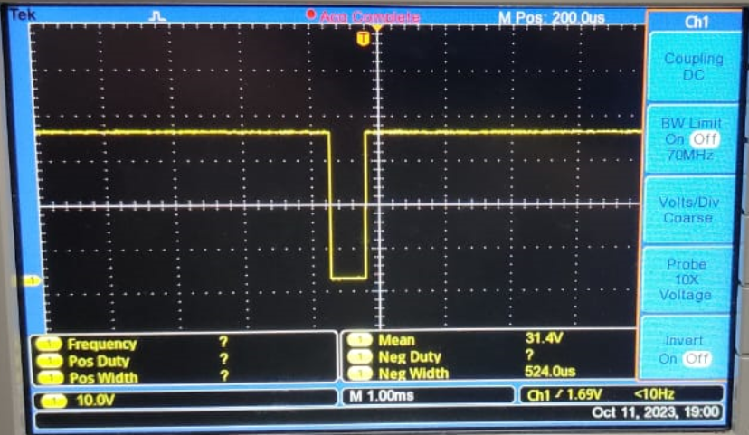

TIRUMALA REDDY B H [EE23MT022]
# Embedded Lab UART Communication
## Objectives
Program your microontroller to transmit:<br>
"F0" if SW1 is pressed<br>
"AA" if SW2 is pressed <br>
Over UART with baud rate 9600 and odd parity. <br>
Your program should also listen for incoming data on the UART with the same baud and parity config; if "AA" is received LED should be GREEN; if "F0" is recieved, the LED should be BLUE and if any error is detected LED should be RED. Test this by communicating with your neighboring group.<br>
   
## Theory
### What is UART ?
UART, which stands for Universal Asynchronous Receiver/Transmitter, is a communication protocol widely used for serial communication between devices. It enables the transfer of data between devices using two wires: one for transmitting (TX) and the other for receiving (RX). UART is asynchronous, meaning that data is transmitted without a shared clock signal, and devices synchronize based on agreed-upon parameters such as baud rate, data bits, parity, and stop bits.

Key points about UART:

#### Asynchronous Communication: 
UART does not rely on a shared clock signal between devices. Instead, both the transmitting and receiving devices agree on communication parameters.

#### Basic Components:<br>
UART communication involves two main components—a transmitter and a receiver. The transmitter converts parallel data into serial form for transmission, and the receiver converts the received serial data back into parallel form.

#### Baud Rate: 
Baud rate defines the speed at which data is transmitted and received. Both communicating devices must operate at the same baud rate for successful communication.

#### Data Framing: 
Each piece of data is framed by start and stop bits, indicating the beginning and end of a data byte. This framing helps the receiver identify and extract the transmitted data.

#### Configurable Parameters: 
UART communication parameters include data bits (usually 8 bits per byte), parity (optional error-checking mechanism), and stop bits (typically 1 or 2 bits).

#### Half-Duplex or Full-Duplex: 
UART supports both half-duplex and full-duplex communication. In half-duplex mode, devices take turns transmitting and receiving, while in full-duplex mode, they can simultaneously transmit and receive.

#### Widespread Usage: 
UART is a fundamental communication protocol and is commonly used in various applications, including serial communication between microcontrollers, sensors, and peripheral devices.

### Calculation
 We calculate Baudrate Register parameters using 9600.
 We get integer and fractional part for baud rate speciification to register by  given expression<br>
   > 16000000/(16*9600)=104.1666 <br>
 

Integer part taken as 104 and we calculated fractional part using below expression
  > 0.167*64+0.5=11
## Code
```C
 main.c
```

## Observation
We got these observations




## References
tm4c123gh6pm data sheet.


